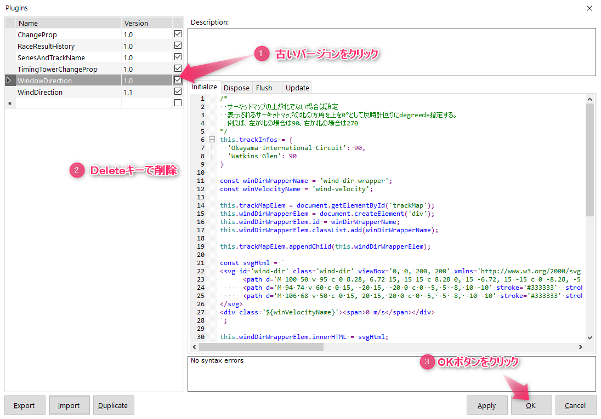

SDK-Gamingプラグイン
==================

概要
------------
* iRacingでSDK-Gamingを利用している方が対象です。
* 各ディレクトリ毎に１つのプラグインとして独立していますので、好きなものだけ選択してインストールします。

インストール方法
------------

### 0. 事前準備
ダウンロードしたzipファイルを解凍します。解凍したディレクトリの中に、プラグインが複数含まれています。インストールしたいプラグインのディレクトリを見つけておきます。  
例：
* プロパティ変更プラグイン→ChangeProp
* シリーズ＆サーキット表示プラグイン→SeriesAndTrackNameなど

### 1. プラグインの登録

#### 1.1. iRacing Live Timingを起動します。

#### 1.2. 「F3」キーを押して設定画面を表示します。
続いて「Overlay」カテゴリの「Plugins」右にある「...」の四角いボタンをクリックします。

#### 1.3. プラグイン画面が表示されますので、左下の「Import」ボタンをクリックします。

#### 1.4. インストールしたいプラグインファイルを選択し開くボタンをクリックします。

#### 1.5. 所望のプラグインが表示され、右のチェックマークが付いていることを確認してOKボタンをクリックします。

### 2. CSSの登録

対象のプラグインディレクトリ内に、拡張子が「.css」または「.css.txt」のファイルがある場合は、続いてCSSを登録します。

#### 2.1. ファイルをダブルクリックして開きます。
notepadもしくはエディタが開き内容が表示されます。

#### 2.2. 設定画面が出ていなければ、1.1., 1.2.を実行し設定画面を表示します。
続いて「Overlay」カテゴリの「Style Overrides」右にある「...」の四角いボタンをクリックします。

#### 2.4. 2.1.で開いたエディタの中身をコピーします。
「Ctrl+a」（全選択） → 「Ctrl+c」（クリップボードへコピー）が簡単です。

#### 2.3. 開いたスタイル入力フィールドの一番下に、ペーストします。
「Ctrl+v」が簡単です。

### 3. 旧プラグインの削除

すでに当該プラグインを使っている場合、プラグインが2個登録されてしまいます。その場合は古いバージョンのプラグインを削除します。
#### 3.1. 1.プラグインの登録の1.2.まで実施し、プラグイン画面を表示します。
プラグインを削除します。

設定方法
------------
* 各プラグインディレクトリのREADMEを参照下さい。

免責事項
------------
* 当ソフトウェアの利用によって生じたあらゆる損害について、責任を負いかねます。利用者のご理解とご了承をお願いします。

使用許諾
------------
* 営利・非営利に関わらず、自由にご利用下さい。
* 連絡等は一切不要です。

その他、改変等について
------------
* 商用利用以外は自由に改変頂いて構いません。
* よりよい改善や機能追加をされた場合は、是非プルリクエストをお願いします！
* バグや、要望はGitHubのIssueを投げてください！反応が遅れるかもしれませんがその時はご容赦を。