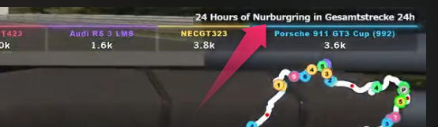

SeriesAndTrackName
==================

概要
------------
* iRacingでSDK-Gamingを利用している方が対象です。
* 本プラグインは、レースのシリーズ（GT Sprint Seriesなど）と、サーキット名を表示するだけのプラグインです。
* デフォルトは右上に表示されますが、CSSの調整で移動可能です。

サンプル画像
------------

インストール方法
------------
* 本ディレクトリの一つ上にあるREADME.pdfかREADME.mdを参照してください。

設定方法
------------
* Window2を使っています。変更したい場合は、プラグインの「Initialize」タブにある、「this.useWindow」を「Window1」～「Window4」のいずれかに変更します。また、CSSも「window-1」～「window-4」のいずれかに変更します。
* CSSはOverlayインスタンスのみ対象にしています。他のインスタンスで表示したい場合は、CSSを変更してください。
* プラグインの中で、Windowを"Show"しているため、非表示にしたい場合はCSSで設定するか、プラグインのチェックを外してください。

免責事項
------------
当ソフトウェアの利用によって生じたあらゆる損害について、責任を負いかねます。利用者のご理解とご了承をお願いします。