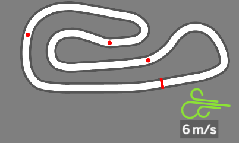

WindDirection
==================

概要
------------
* iRacingでSDK-Gamingを利用している方が対象です。
* 本プラグインは、マップの片隅に風向と風速を表示します。
* 微風はライトブルー、強くなるにつれてライトグリーン、オレンジ、赤と変化します。
* コースマップの「北」が上になるわけではないため、コース毎に独自で調査しました。  
ただ、全てが網羅できているわけではないので、定義がないコースの場合は非表示になります。  
ロードレース用コースはほぼ網羅したつもりですが、非表示になるコースがあれば GitHubのIssue などで教えてください。

サンプル画像
------------


インストール方法
------------
* 本ディレクトリの一つ上にあるREADME.pdfかREADME.mdを参照してください。

設定方法
------------
* マップ(TrackMap）に画像を追加しています。
* すべてのインスタンスに表示されます。
* どちらか片方を非表示にしたい場合は、CSSで「display: none」にセットしてください。
```css
/* Hudインスタンスで表示したくない場合 */
.hud>.track-map>.wind-dir-wrapper {
   display: none; 
}
```

免責事項
------------
当ソフトウェアの利用によって生じたあらゆる損害について、責任を負いかねます。利用者のご理解とご了承をお願いします。
